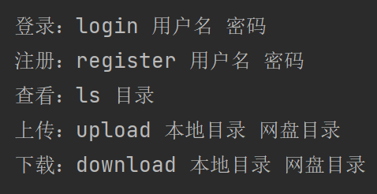

# 与君初相识，犹见故人归。
# 欢迎使用本软件！
# 这是一个云盘软件。
# 你可以使用我们的客户端，将你个人的任意格式的文件，通过网络的方式传输到我们的服务器中进行保存。
# 它是一个CS架构的软件，基于TCP协议实现，这能够保障你的数据在传输过程中的完整性。
# 运行环境：你需要使用CPython解释器运行它，版本可以是3~3.9的任意版本。Cpython解释器可以到官网下载，此处提供官网链接https://www.python.org/
# 运行系统：Windows7、8、10、11系统版本,Mac系统、Linux系统皆可运行。
# 模块使用：在这个软件里面，使用到了os、re、time、struct、json、socket模块，这些都由CPython解释器内部提供，不需要另外下载。
# 注意，本软件仅支持同一时间内对单个访问用户进行一对一服务。

# 使用步骤：
1.打开Pan_C文件夹；
2.使用Cpython解释器，启动app.py文件，它将自动去执行内部的方法。当然在这之前，我们的服务器端必须先运行起来！
3.接下来，你将看到客户端的系统提示：你需要在回车执行命令之前，按照上面系统给出的提示，输入你的需求，并在前面加上英文命令！

4.第一步，你需要先进行注册，按照系统给出的格式：register 用户名 密码，进行注册。注册后，服务器系统会自动为你创建一个独立空间，存放你的私人文件，每个用户只能查看自己的文件。
5.第二步，登录。不登录就无法进行目录访问，文件上传和下载操作。
6.未下载完全的文件支持“断点续传”功能，前提是你没有改变已下载文件的文件名和位置。
7.需要退出系统，只需要输入英文字母 Q ，大小写都可以。
8.感谢使用本软件，技术交流或意见反馈，请联系xxxxxxxxxxx。